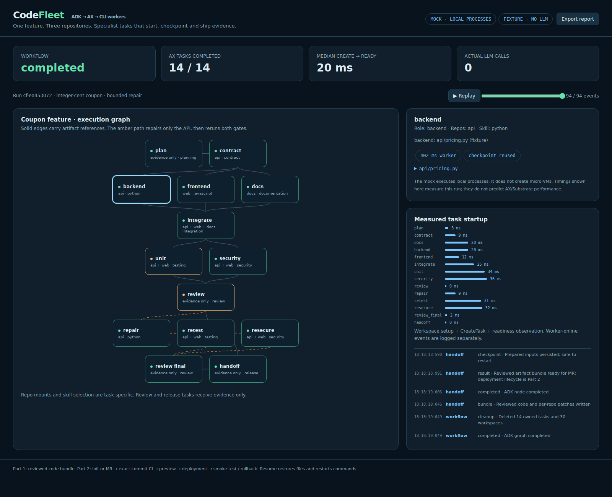
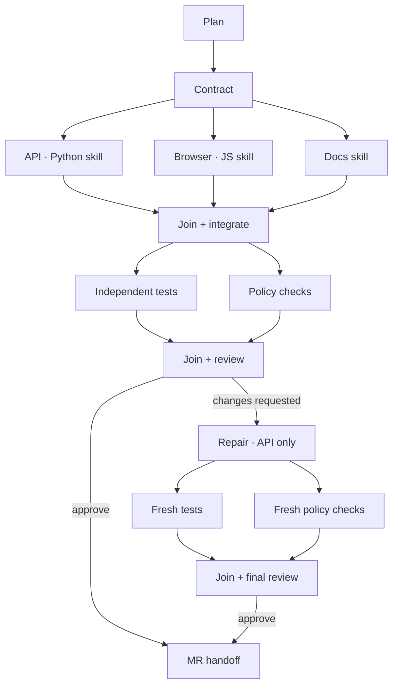

# CodeFleet · ADK + AX distributed coding

**A feature crosses three repositories. Google ADK schedules the graph; AX runs
short-lived specialist CLI commands; reviewers receive evidence rather than entire repositories.**



[Recorded timeline replay](evidence/demo.webm) · [Offline dashboard](evidence/replay.html)

The recording replays a real tested mock-run event trace; it is not a recording
of real AX micro-VM execution. Download `replay.html` and open it locally for the
interactive timeline and task evidence.

The demo adds percentage coupons to a Python pricing API, a JavaScript browser
preview and product docs. It demonstrates parallel coding, hash-checked integration,
independent tests, a bounded API-only repair and a reviewed MR handoff.

**Every AX task uses `spec.command`. No AX `Model`, Gemini key, Antigravity harness
or AX model-provider integration is required.** Coding commands can call an
OpenAI-compatible endpoint directly, including the endpoint served by Unsloth Studio.

## Run in one minute

Prerequisites: Go **1.27.1+**, Git, Python 3.12+, Node 22+. Windows: run under WSL2.

```bash
make build
./bin/codefleet demo
```

Open **http://127.0.0.1:8088**. The demo starts its own **mock AX gRPC service**,
an artifact broker and the real ADK Go graph. It injects a transient gRPC failure,
restarts the backend after a durable checkpoint, detects a fractional-cent bug,
repairs it and reruns both validation gates. The dashboard stays available afterwards.

```bash
make verify                         # race tests + five end-to-end scenarios
docker compose up --build           # alternative: bundled toolchains
./bin/codefleet demo --exit         # noninteractive / CI
./bin/codefleet demo --cycle=false --inject-bug=false --delay-ms 0 --exit
```

The default `fixture` mode needs no LLM or API key. Its code proposals are
deterministic fixtures, clearly labeled in the dashboard. The mock runs **local
processes with separate Git clones**, not micro-VMs or a security sandbox. It uses
the official AX protobuf and gRPC service definitions, not invented REST endpoints.
Docker Compose is included but was not run in the authoring environment.

## The coding graph



This is the **actual ADK v2 `workflow` graph**, built with `NewFunctionNode`,
`NewJoinNode`, conditional routes, retry policies, timeouts and a concurrency cap.
It is executed by an ADK `Runner`. The scheduler is deterministic; LLMs write code
inside the command workers. ADK does not need a model to schedule this graph.

| Task | Repositories mounted | Skill | Work |
| --- | --- | --- | --- |
| Plan | none | planning | fixed feature graph and acceptance criteria |
| Contract | api | contract | language-neutral input/rounding contract |
| Backend | api | python | `pricing.py` |
| Frontend | web | javascript | `coupon.mjs` |
| Docs | docs | documentation | product `README.md` |
| Integrate | api, web, docs | integration | ordered artifacts; reject stale bases |
| Unit / retest | api, web | testing | actual unittest + node:test processes |
| Security / resecure | api, web | security | narrow syntax/input policy checks |
| Review / final review | none | review | require four fresh passing checks |
| Repair | api | python | one API-only attempt; tests cannot be changed |
| Handoff | none | release | reviewed bundle and MR text |

Only the integrator needs all three repositories. Each task gets exactly one skill
workspace. Tests are provided independently from the code proposals. A review that
still fails after repair stops the graph; it does not hand off or deploy bad code.
The repair scope is deliberately tailored to this coupon scenario; this first
version is not a general-purpose repository editing agent.

## Use your local LLM (still CLI tasks)

```bash
export OPENAI_BASE_URL='http://YOUR_UNSLOTH_HOST:PORT/v1'
export OPENAI_MODEL='YOUR_SERVED_MODEL_ID'
# Optional if your server requires it:
export OPENAI_API_KEY='YOUR_KEY'

./bin/codefleet demo --mode llm --cycle=false --delay-ms 0
```

The endpoint must be reachable **from the worker**. With remote AX tasks,
`localhost` refers to the sandbox, not your workstation. Use a reachable address
or your existing tunnel. Obtain the model ID from your server; no model name is
hardcoded. Concurrent CLI tasks can share one inference server: distribution of
tasks does not imply distribution of GPUs or faster inference on one GPU.

Three coding commands make bounded `/chat/completions` calls; an API repair adds
a fourth call if necessary. Each model may propose only the full replacement for
its one allowed file. Commands, tests and graph edges are selected by the program.
Credentials are returned only in the authenticated input for the relevant coding
job. They are absent from AX task manifests, dashboard reports and checkpoints.
For remote credentials, put the broker behind HTTPS or a private trusted network.

Planning, contract, integration and review remain deterministic in both modes.
`--inject-bug` only affects fixture proposals. The provider mock used by tests
exercises the API path; it is **not evidence of real model quality or inference**.

## Connect to a real AX control plane

Requires AX + Agent Substrate already installed and a registry the cluster can
pull from. This project does not install the substrate or claim it can run on
every Kubernetes distribution.

```bash
export IMAGE='ghcr.io/YOUR_ORG/codefleet:0.1.0'
docker build --platform linux/amd64 -t "$IMAGE" .
docker push "$IMAGE"

# After checking the service name/port in your AX installation:
kubectl -n ax-system port-forward svc/ax-server 50051:8080

./bin/codefleet run --backend ax \
  --endpoint 127.0.0.1:50051 --insecure \
  --image "$IMAGE" \
  --listen 0.0.0.0:8088 \
  --worker-broker 'https://YOUR_REACHABLE_BROKER' \
  --mode llm --cycle=false --delay-ms 0
```

`--worker-broker` must route to this running broker from the AX tasks. A laptop
port-forward does not provide reverse connectivity into the laptop. For TLS gRPC,
omit `--insecure`, and supply `--ca-file` if your CA is private. `AX_TOKEN` is forwarded
as gRPC authorization metadata; its enforcement depends on your AX installation.

The image includes a lightweight **custom command runner** at the exact path AX
launches: `/usr/local/bin/ax-task-runner`. It prepares declared workspaces, serves
`/healthz`, `/readyz` and metadata, starts `spec.command`, stays online after command
exit and forwards shutdown signals to the command process group. `debug` is false;
guest services / `ax ssh` are not implemented by this runner. No workspace bootstrap
goal is supplied, so startup never requires an AX-supported LLM provider.

By default, sample source files are supplied via `Workspace.spec.files`. For actual
Git provisioning, import `demo/repos/api`, `web` and `docs` into three repositories
with the same baseline, then pass `--repo-api URL --repo-web URL --repo-docs URL
--repo-ref TAG`. These options target the demo layout, not arbitrary production
repositories. Use immutable tags and pinned image digests when comparing runs.

**The real-cluster path is implemented but was not executed here.** The tested
path uses the same generated AX client against the mock service. Runner contract
tests cover durable initialization and keeping readiness after command exit.

## Resume: what this demo guarantees

See [the full lifecycle analysis](docs/resume.md). The crucial facts are:

* AX restores the durable `/workspace` directory and starts a new container/process
  tree. It does not restore a suspended Python/Go call stack or an in-flight HTTP call.
* The AX task spec is immutable. `ResumeTask` takes `atespace` and `name`, with no
  command or prompt. It does not offer a new-input channel.
* The worker reloads its persisted input baseline and checkpoint. The automatic
  cycle test interrupts **after preparation and before generation**, then proves
  that a new process reuses the checkpoint.
* A model call interrupted before its output is checkpointed may be repeated.
  A Git push, merge or deployment is not made exactly-once by suspend/resume.
* The task runner keeps its initialization marker **inside `/workspace`** and does
  not re-clone or rewrite a restored workspace on restart.
* The broker and ADK invocation remain live during the cycle. Recovery of the
  orchestrator after its own crash is not implemented in Part 1.

## Evidence and artifacts

Each run writes `runs/cf-*/` containing:

* `replay.html`: a standalone offline dashboard with timeline playback;
* `report.json` / `events.jsonl`: task scope, results, timings and lifecycle;
* `bundle/api`, `bundle/web`, `bundle/docs`: reviewed working copies;
* `api.patch`, `web.patch`, `docs.patch`: final per-repo differences, including new files;
* `artifacts.json`: ordered changes including added contract file and SHA256 hashes;
* `MR.md`: a draft description for Part 2;
* `actors/*/worker.log` and checkpoints: local mock debug evidence.

The default repair path reaches 14 tasks; the direct approval path reaches 10.

To regenerate visual proof from a repaired run:

```bash
npm ci
npx playwright install chromium
npm run capture -- runs/YOUR_RUN/replay.html evidence
```

CI executes the graph tests and captures/asserts the dashboard, then uploads the
reports, patches, screenshots and timeline recording as workflow artifacts.

The dashboard reports **Create → WorkspaceReady**, separately from worker-online
and worker duration. `--delay-ms` adds a presentation pause, not a cold-start model.
Use `--cycle=false --delay-ms 0` for startup experiments. Mock latency is local
process overhead, **not an AX/Substrate benchmark**. Toolchains are baked into the
image and skills are tiny, making the intended warm-start pattern explicit.

## Next: init or MR → deployment

[Part 2 design](docs/part2.md) defines the next graph, event schemas and gates.
It starts from repository initialization or an opened/updated MR, pins the exact
commit, runs CI and preview validation, then deploys and checks rollback.
No remote MR, merge, registry publication or deployment occurs automatically here.

## Source layout

| Path | Responsibility |
| --- | --- |
| `internal/flow` | ADK graph, joins and review routes |
| `internal/axclient` | typed AX gRPC calls, ownership and cleanup |
| `internal/taskrunner` | AX CLI runner; durable initialization |
| `internal/worker` | checkpointed CLI commands and compatible LLM client |
| `internal/mockax` | mock gRPC service and local process lifecycle |
| `internal/broker` | scoped inputs, immutable results, event log |
| `demo/repos`, `demo/skills` | isolated source fixtures and specialist skills |
| `web` | live and offline evidence dashboard |
| `scripts/verify_demo.py` | full executable acceptance scenarios |

Upstream APIs are pinned in `go.mod` / `go.sum` to AX commit
[`ac2332829f22`](https://github.com/google/ax/tree/ac2332829f22360ff97b0ba34d94dd0dd782f17e)
and ADK-Go commit
[`8c7ab1baf9bc`](https://github.com/google/adk-go/tree/8c7ab1baf9bcd9eedd28e4b13ed71f37c239b41d).
AX remains under active development. [Verified official sources](docs/sources.md).
