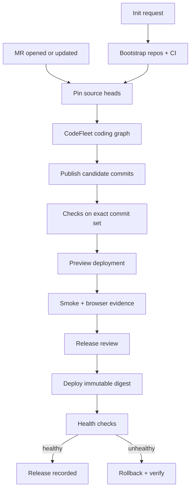

# Part 2 · repository init or MR → deployment

**Design for the next iteration, after review of the working first demo. This is
not an implemented forge/deployment integration.** Part 1 ends at the reviewed
bundle, hashes and `MR.md`.

## Two entry points, one commit-bound pipeline



Multi-repo source is a **commit set**, not one ambiguous branch name:
`{api:sha, web:sha, docs:sha}`. Any new MR commit invalidates the prior candidate's
release approval and downstream evidence. Never deploy from a floating branch
because a previous commit had green checks.

## Event input

```json
{
  "schema_version": 1,
  "event_id": "forge-delivery-id",
  "kind": "mr.updated",
  "repository": "owner/api",
  "mr_number": 42,
  "head_sha": "exact-full-commit-sha",
  "base_sha": "exact-full-base-sha",
  "requested_goal": "Add coupon support",
  "environment": "preview"
}
```

The webhook adapter validates the forge signature, deduplicates `event_id`, obtains
authoritative MR metadata and cancels superseded invocations. It never accepts a
deployment target or executable shell command from the MR body. Init requests use
a separate reviewed configuration specifying repository names, stack and targets.

## CLI task graph and segmentation

| Stage | Scope / skill | Result gate |
| --- | --- | --- |
| Init | new repos / scaffolding | baseline commits, AGENTS, CI, manifests |
| Triage | MR diff metadata / planning | requested scope + acceptance criteria |
| Code | exactly one repo / language skill | bounded file patch + base SHA |
| Tests | necessary repos / testing | exit code, logs, coverage or browser evidence |
| Review | immutable artifacts and evidence / review | approval tied to commit set |
| Forge publish | candidate repo / forge skill | remote branch + MR IDs, effect ledger |
| Build | source heads / packaging | digest + provenance for the exact source |
| Preview | preview namespace / deployment | immutable image digest, endpoint |
| Validate | preview endpoint / Playwright or smoke | screenshots, recording, assertions |
| Release | reviewed metadata / release | decision tied to candidate digest |
| Deploy | chosen environment / deployment | external deployment revision |
| Observe | endpoint and metrics / operations | healthy release or rollback result |

Code agents have no forge merge or deployment credentials. The deployment task
does not need source-editing skills. Each task still launches a CLI command under
AX, so provider support remains independent from AX `Model` resources. Specialized
images bake the needed tools: Go/Python/Node, Playwright, build tooling or deployment
client. Warm images, narrow workspaces and tiny skill payloads avoid repeated
bootstrap work; actual startup distributions must be measured on the substrate.

## External effect journal and recovery

Persist orchestration state outside task RAM: request, graph version, node attempts,
task names, commit set, artifact digest and effect journal. Each effect identity is
derived from `run_id + stage + target + candidate_digest`.

| Effect | Before retrying after interruption |
| --- | --- |
| Push candidate | compare remote ref with intended commit and lease/base |
| Create MR | search for the run/candidate marker; adopt the existing MR |
| Build/publish image | look up immutable digest and recorded source provenance |
| Merge | fetch MR state and head; require the reviewed head still matches |
| Deploy | read deployment revision/digest; reconcile actual rollout |
| Roll back | confirm the intended known-good revision and its health |

Suspend only at explicit safe checkpoints. During an external operation, record
intent before calling the API and reconcile after a restart. `resume` is a restart
of the same command and its persisted application state, not replay protection for
these APIs. If the command, repo set or access scope changes, create a new task.

## Demonstration acceptance criteria

1. Init produces runnable repositories and CI; MR entry handles an existing codebase.
2. Two deliveries of the same webhook do not publish two candidate MRs or releases.
3. A new head SHA cancels/stales the previous candidate and prevents stale deployment.
4. A deliberately failing test blocks publication or deployment.
5. Preview generates a meaningful browser recording and inspected screenshots.
6. Worker restart before and after a simulated push response proves reconciliation.
7. A failed deployment rolls back to the last known-good digest and verifies health.
8. Dashboard links candidate commits, MR, CI evidence, image digest and rollout.

For the first concrete deployment adapter, choose one target: Docker Compose,
Kubernetes manifests, or GitOps/ArgoCD. GitOps deploy should publish a reviewed
environment-repo commit and observe Argo's rollout, rather than bypass the existing
delivery mechanism with an unrelated `kubectl apply`.
